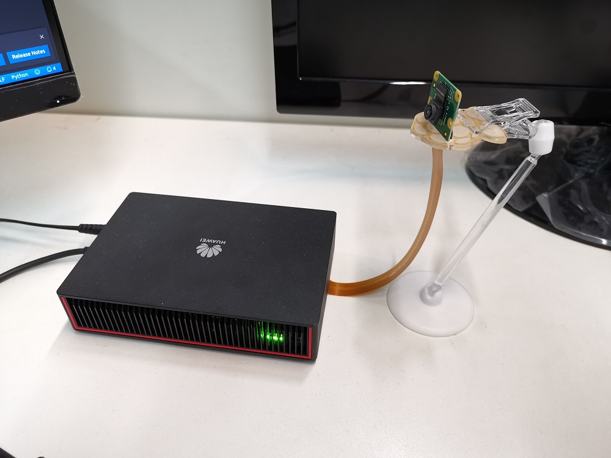
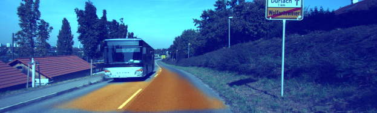
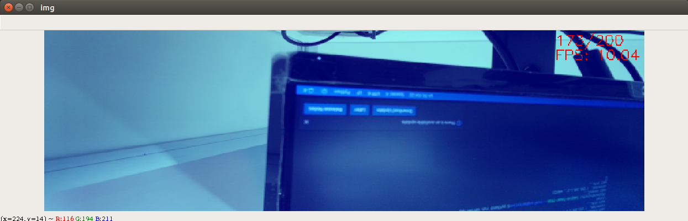
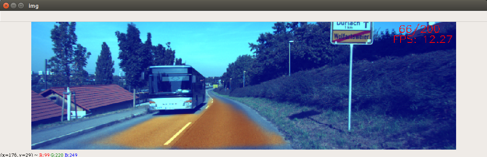

EN|[CN](README_cn.md)

# Road Segmentation

This application runs on the Atlas 200 DK and implements the road segmentation by using fcn network.

<p align='center'>
    
</p>

<p align='center'>
    
</p>

<p align='center'>
    
</p>

## Prerequisites

Before using an open source application, ensure that:

-   Mind Studio  has been installed.
-   The Atlas 200 DK developer board has been connected to  Mind Studio, the cross compiler has been installed, the SD card has been prepared, and basic information has been configured.

## Software Preparation

Before running the application, obtain the source code package and configure the environment as follows.

1. Obtain the source code package.

   Download all the code in the road-segmentation repository at  [https://github.com/Ascend/road-segmentation](https://github.com/Ascend/road-segmentation)  to any directory on Ubuntu Server where  Mind Studio  is located as the  Mind Studio  installation user, for example,  _/home/ascend/road-segmentation_.


2.  Log in to Ubuntu Server where  Mind Studio  is located as the  Mind Studio  installation user and set the environment variable  **DDK\_HOME**.

    **vim \~/.bashrc**

    Run the following commands to add the environment variables  **DDK\_HOME**  and  **LD\_LIBRARY\_PATH**  to the last line:

    **export DDK\_HOME=/home/XXX/tools/che/ddk/ddk**

    **export LD\_LIBRARY\_PATH=$DDK\_HOME/uihost/lib**

    >**NOTE:**   
    >-   **XXX**  indicates the  Mind Studio  installation user, and  **/home/XXX/tools**  indicates the default installation path of the DDK.  
    >-   If the environment variables have been added, skip this step.  

    Enter  **:wq!**  to save and exit.

    Run the following command for the environment variable to take effect:

    **source \~/.bashrc**


## Deployment

1.  Access the root directory where the application code is located as the  Mind Studio  installation user, for example,  **_/home/ascend/road-segmentation_**.
2.  Run the deployment script to prepare the project environment, including compiling and deploying the ascenddk public library and application.

    bash deploy.sh  _host\_ip_ _model\_mode_

    -   _host\_ip_: For the Atlas 200 DK developer board, this parameter indicates the IP address of the developer board.
    -   _model\_mode_  indicates the deployment mode of the model file. The default setting is  **internet**.
        -   **local**: If the Ubuntu system where  Mind Studio  is located is not connected to the network, use the local mode. In this case, download the dependent common code library ezdvpp to the  **sample-objectdetection/script**  directory by referring to the  [Downloading Dependent Code Library](#en-us_topic_0182554604_section92241245122511).
        -   **internet**: Indicates the online deployment mode. If the Ubuntu system where  Mind Studio  is located is connected to the network, use the Internet mode. In this case, download the dependent code library ezdvpp online.


    Example command:
    
    **bash deploy.sh 192.168.1.2**

3. Upload the generated Da Vinci offline model **kittisegRealTime.om** to the directory of the  **HwHiAiUser**  user on the host.

   ```bash
   scp kittisegRealTime.om HwHiAiUser@host_ip:/home/HwHiAiUser/HIAI_PROJECTS/ascend_workspace/segmentation/out/kittisegRealTime.om
   ```

   For the Atlas 200 DK, the default value of  _**host\_ip**_  is  **192.168.1.2**  \(USB connection mode\) or  **192.168.0.2**  \(NIC connection mode\).


## Running

1.  run server on the host
    
    ```bash
    python3 run_server.py
    ```

2. Log in to the Host as the  **HwHiAiUser**  user in SSH mode on Ubuntu Server where  Mind Studio  is located.

   ```bash
   ssh HwHiAiUser@host_ip
   ```

   For the Atlas 200 DK, the default value of  _**host\_ip**_  is  **192.168.1.2**  \(USB connection mode\) or  **192.168.0.2**  \(NIC connection mode\).

3.  Go to the path of the executable file of road segmentation application.

    **cd \~/HIAI\_PROJECTS/ascend\_workspace/segmentation/out**

4.  Run the application.

    Camera Test
    
    ```bash
    ./ascend_segmentation
    ```
    
    
    Picture Test
    
    ```bash
    ./ascend_segmentation 1
    ```
    
    
    - Width of the input image: 623px
    - Height of the input image: 188px


## Downloading Dependent Code Library<a name="en-us_topic_0182554604_section92241245122511"></a>

Download the dependent software libraries to the  road-segmentation/script**  directory.

**Table  2**  Download the dependent software library

<table><thead align="left"><tr id="en-us_topic_0182554604_row177421045163614"><th class="cellrowborder" valign="top" width="33.33333333333333%" id="mcps1.2.4.1.1"><p id="en-us_topic_0182554604_p574264511368"><a name="en-us_topic_0182554604_p574264511368"></a><a name="en-us_topic_0182554604_p574264511368"></a>Module Name</p>
</th>
<th class="cellrowborder" valign="top" width="33.33333333333333%" id="mcps1.2.4.1.2"><p id="en-us_topic_0182554604_p1474224573615"><a name="en-us_topic_0182554604_p1474224573615"></a><a name="en-us_topic_0182554604_p1474224573615"></a>Module Description</p>
</th>
<th class="cellrowborder" valign="top" width="33.33333333333333%" id="mcps1.2.4.1.3"><p id="en-us_topic_0182554604_p1174264533610"><a name="en-us_topic_0182554604_p1174264533610"></a><a name="en-us_topic_0182554604_p1174264533610"></a>Download Address</p>
</th>
</tr>
</thead>
<tbody><tr id="en-us_topic_0182554604_row20743104593620"><td class="cellrowborder" valign="top" width="33.33333333333333%" headers="mcps1.2.4.1.1 "><p id="en-us_topic_0182554604_p19743145183614"><a name="en-us_topic_0182554604_p19743145183614"></a><a name="en-us_topic_0182554604_p19743145183614"></a>EZDVPP</p>
</td>
<td class="cellrowborder" valign="top" width="33.33333333333333%" headers="mcps1.2.4.1.2 "><p id="en-us_topic_0182554604_p11743164543616"><a name="en-us_topic_0182554604_p11743164543616"></a><a name="en-us_topic_0182554604_p11743164543616"></a>Encapsulates the DVPP interface and provides image and video processing capabilities, such as color gamut conversion and image / video conversion</p>
</td>
<td class="cellrowborder" valign="top" width="33.33333333333333%" headers="mcps1.2.4.1.3 "><p id="en-us_topic_0182554604_p87434456368"><a name="en-us_topic_0182554604_p87434456368"></a><a name="en-us_topic_0182554604_p87434456368"></a><a href="https://github.com/Ascend/sdk-ezdvpp" target="_blank" rel="noopener noreferrer">https://github.com/Ascend/sdk-ezdvpp</a></p>
<p id="en-us_topic_0182554604_p4743154512368"><a name="en-us_topic_0182554604_p4743154512368"></a><a name="en-us_topic_0182554604_p4743154512368"></a>After the download, keep the folder name <span class="filepath" id="en-us_topic_0182554604_filepath17433454366"><a name="en-us_topic_0182554604_filepath17433454366"></a><a name="en-us_topic_0182554604_filepath17433454366"></a><b>ezdvpp</b></span>.</p>
</td>
</tr>
</tbody>
</table>
