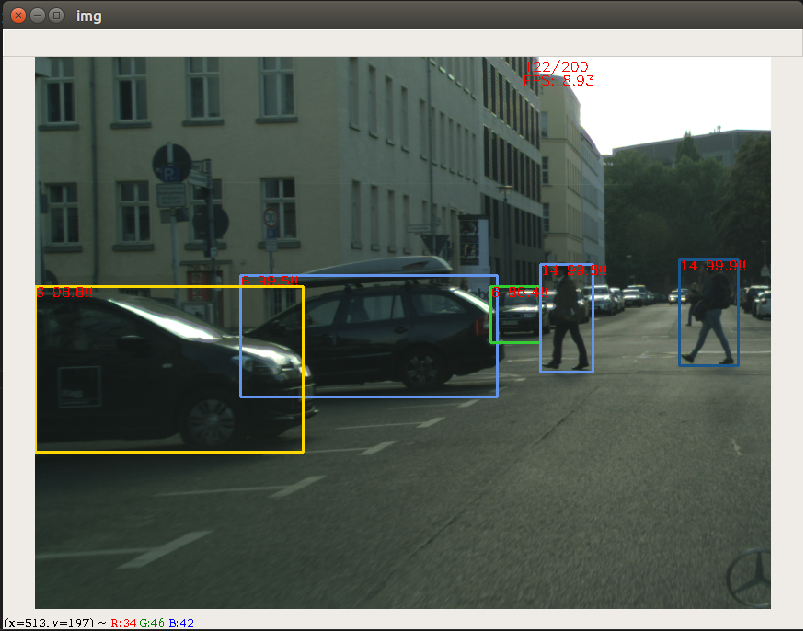
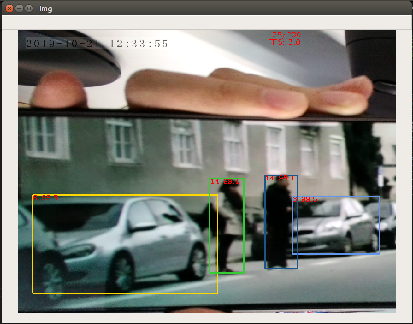
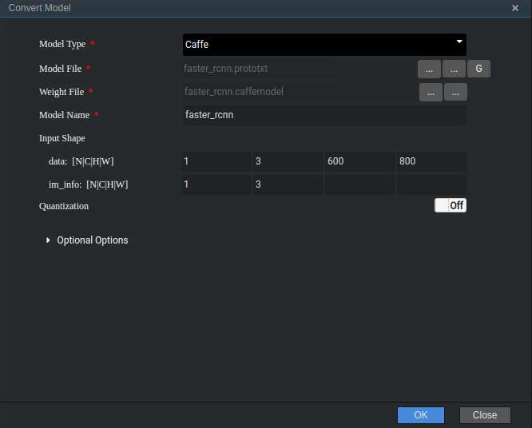

中文|[英文](README.md)

# ObjDetection<a name="ZH-CN_TOPIC_0185837719"></a>

本Application支持运行在Atlas 200 DK实现了对faster-rcnn目标检测网络的实时推理功能。

<p align='center'>
    
</p>

<p align='center'>
    
</p>

<p align='center'>
    
</p>

## 前提条件<a name="zh-cn_topic_0182554604_section137245294533"></a>

部署此Sample前，需要准备好以下环境：

-   已完成Mind Studio的安装。
-   已完成Atlas 200 DK开发者板与Mind Studio的连接，交叉编译器的安装，SD卡的制作及基本信息的配置等。

## 软件准备<a name="zh-cn_topic_0182554604_section181111827718"></a>

运行此Sample前，需要按照此章节获取源码包，并进行相关的环境配置。

1.  获取源码包。

    将[https://github.com/Ascend/objDetection](https://github.com/Ascend/objDetection)仓中的代码以Mind Studio安装用户下载至Mind Studio所在Ubuntu服务器的任意目录，例如代码存放路径为：_/home/ascend/objDetection_。

2.  <a name="zh-cn_topic_0182554604_li2074865610364"></a>获取此应用中所需要的原始网络模型。

    参考[表1](#zh-cn_topic_0182554604_table19942111763710)获取此应用中所用到的原始网络模型及其对应的权重文件，并将其存放到Mind Studio所在Ubuntu服务器的任意目录，例如$HOME/ascend/models/faster\_rcnn。

    **表 1**  检测网络应用使用模型

    <a name="zh-cn_topic_0182554604_table19942111763710"></a>
    <table><thead align="left"><tr id="zh-cn_topic_0182554604_row611318123710"><th class="cellrowborder" valign="top" width="11.959999999999999%" id="mcps1.2.4.1.1"><p id="zh-cn_topic_0182554604_p81141820376"><a name="zh-cn_topic_0182554604_p81141820376"></a><a name="zh-cn_topic_0182554604_p81141820376"></a>模型名称</p>
    </th>
    <th class="cellrowborder" valign="top" width="8.07%" id="mcps1.2.4.1.2"><p id="zh-cn_topic_0182554604_p13181823711"><a name="zh-cn_topic_0182554604_p13181823711"></a><a name="zh-cn_topic_0182554604_p13181823711"></a>模型说明</p>
    </th>
    <th class="cellrowborder" valign="top" width="79.97%" id="mcps1.2.4.1.3"><p id="zh-cn_topic_0182554604_p1717182378"><a name="zh-cn_topic_0182554604_p1717182378"></a><a name="zh-cn_topic_0182554604_p1717182378"></a>模型下载路径</p>
    </th>
    </tr>
    </thead>
    <tbody><tr id="zh-cn_topic_0182554604_row1119187377"><td class="cellrowborder" valign="top" width="11.959999999999999%" headers="mcps1.2.4.1.1 "><p id="zh-cn_topic_0182554604_p7118189378"><a name="zh-cn_topic_0182554604_p7118189378"></a><a name="zh-cn_topic_0182554604_p7118189378"></a>faster_rcnn</p>
    </td>
    <td class="cellrowborder" valign="top" width="8.07%" headers="mcps1.2.4.1.2 "><p id="zh-cn_topic_0182554604_p151818183718"><a name="zh-cn_topic_0182554604_p151818183718"></a><a name="zh-cn_topic_0182554604_p151818183718"></a>目标检测网络模型。</p>
    <p id="zh-cn_topic_0182554604_p11121816373"><a name="zh-cn_topic_0182554604_p11121816373"></a><a name="zh-cn_topic_0182554604_p11121816373"></a>是基于Caffe的Faster RCNN模型。</p>
    </td>
    <td class="cellrowborder" valign="top" width="79.97%" headers="mcps1.2.4.1.3 "><p id="zh-cn_topic_0182554604_p611318163718"><a name="zh-cn_topic_0182554604_p611318163718"></a><a name="zh-cn_topic_0182554604_p611318163718"></a>请参考<a href="https://github.com/Ascend/models/tree/master/computer_vision/object_detect/faster_rcnn" target="_blank" rel="noopener noreferrer">https://github.com/Ascend/models/tree/master/computer_vision/object_detect/faster_rcnn</a>目录中README.md下载原始网络模型文件及其对应的权重文件。</p>
    </td>
    </tr>
    </tbody>
    </table>

3.  将原始网络模型转换为Davinci模型。
    1.  在Mind Studio操作界面的顶部菜单栏中选择“Tool \> Convert Model”，进入模型转换界面。
    2.  在弹出的**Convert Model**操作界面中，Model File与Weight File分别选择[2](#zh-cn_topic_0182554604_li2074865610364)中下载的模型文件和权重文件。
        -   **Model Name**填写为[表1](#zh-cn_topic_0182554604_table19942111763710)对应的**模型名称**：faster\_rcnn。
        -   其他保持默认值。

            **图 1**  faster\_rcnn模型转换配置<a name="zh-cn_topic_0182554604_fig79252510407"></a>  
            


    3.  单击OK开始转换模型。
    
        模型转换成功后，后缀为.om的Davinci模型存放地址为$HOME/tools/che/model-zoo/my-model/fast\_rcnn。


4.  以Mind Studio安装用户登录Mind Studio所在Ubuntu服务器，并设置环境变量DDK\_HOME。

    **vim \~/.bashrc**

    执行如下命令在最后一行添加DDK\_HOME及LD\_LIBRARY\_PATH的环境变量。

    **export DDK\_HOME=/home/XXX/tools/che/ddk/ddk**

    **export LD\_LIBRARY\_PATH=$DDK\_HOME/uihost/lib**

    >**说明：**   
    >
    >-   XXX为Mind Studio安装用户，/home/XXX/tools为DDK默认安装路径。  
>-   如果此环境变量已经添加，则此步骤可跳过。  
    
输入:wq!保存退出。
    
执行如下命令使环境变量生效。
    
    **source \~/.bashrc**


## 部署<a name="zh-cn_topic_0182554604_section3723145213347"></a>

1.  以Mind Studio安装用户进入目标检测网络应用代码所在根目录，如_/home/ascend/objDetection_。
2.  执行部署脚本，进行工程环境准备，包括公共库的编译与部署、应用的编译与部署等操作。

    bash deploy.sh  _host\_ip_ _model\_mode_

    -   _host\_ip_：对于Atlas 200 DK开发者板，即为开发者板的IP地址。对于AI加速云服务器，即为Host的IP地址。
    -   local：若Mind Studio所在Ubuntu系统未连接网络，请使用local模式，执行此命令前，需要参考[公共代码库下载](#zh-cn_topic_0182554604_section92241245122511)将依赖的公共代码库ezdvpp下载到“sample-objectdetection/script“目录下。
    -   internet：若Mind Studio所在Ubuntu系统已连接网络，请使用internet模式，在线下载依赖代码库ezdvpp。

    命令示例：

    **bash deploy.sh 192.168.1.2 internet**

3.  将需要使用的已经转换好的Davinci离线模型文件上传至Host侧_~/HIAI\_PROJECTS/ascend\_workspace/objDetection/out_目录下。

    ```bash
scp faster_rcnn.om HwHiAiUser@host_ip:/home/HwHiAiUser/HIAI_PROJECTS/ascend_workspace/objDetection/out/faster_rcnn.om
    ```

    对于Atlas 200 DK，host\_ip默认为192.168.1.2（USB连接）或者192.168.0.2（NIC连接）。


## 运行<a name="zh-cn_topic_0182554604_section87121843104920"></a>

1.  在Mind Studio所在Ubuntu服务器中，执行

    ```bash
python3 run_server.py
    ```

2. 在Mind Studio所在Ubuntu服务器中，以HwHiAiUser用户SSH登录到Host侧。

   ```bash
   ssh HwHiAiUser@host_ip
   ```

   对于Atlas 200 DK，host\_ip默认为192.168.1.2（USB连接）或者192.168.0.2（NIC连接）。

3. 进入路面分割网络应用的可执行文件所在路径。

   ```bash
   cd ~/HIAI_PROJECTS/ascend_workspace/segmentation/out
   ```

4. 执行应用程序

   使用相机获取图片

   ```bash
   ./ascend_segmentation
   ```

   

   使用测试图片

   ```bash
   ./ascend_segmentation 1
   ```

   

## 公共代码库下载<a name="zh-cn_topic_0182554604_section92241245122511"></a>

将依赖的软件库下载到“objDetection/script“目录下。

**表 2**  依赖代码库下载

<a name="zh-cn_topic_0182554604_table75751912124510"></a>
<table><thead align="left"><tr id="zh-cn_topic_0182554604_row3576111214511"><th class="cellrowborder" valign="top" width="33.33333333333333%" id="mcps1.2.4.1.1"><p id="zh-cn_topic_0182554604_p5576712114510"><a name="zh-cn_topic_0182554604_p5576712114510"></a><a name="zh-cn_topic_0182554604_p5576712114510"></a>模块名称</p>
</th>
<th class="cellrowborder" valign="top" width="33.33333333333333%" id="mcps1.2.4.1.2"><p id="zh-cn_topic_0182554604_p157661218455"><a name="zh-cn_topic_0182554604_p157661218455"></a><a name="zh-cn_topic_0182554604_p157661218455"></a>模块描述</p>
</th>
<th class="cellrowborder" valign="top" width="33.33333333333333%" id="mcps1.2.4.1.3"><p id="zh-cn_topic_0182554604_p10576201211454"><a name="zh-cn_topic_0182554604_p10576201211454"></a><a name="zh-cn_topic_0182554604_p10576201211454"></a>下载地址</p>
</th>
</tr>
</thead>
<tbody><tr id="zh-cn_topic_0182554604_row1757621219458"><td class="cellrowborder" valign="top" width="33.33333333333333%" headers="mcps1.2.4.1.1 "><p id="zh-cn_topic_0182554604_p15576212114511"><a name="zh-cn_topic_0182554604_p15576212114511"></a><a name="zh-cn_topic_0182554604_p15576212114511"></a>EZDVPP</p>
</td>
<td class="cellrowborder" valign="top" width="33.33333333333333%" headers="mcps1.2.4.1.2 "><p id="zh-cn_topic_0182554604_p1257661204510"><a name="zh-cn_topic_0182554604_p1257661204510"></a><a name="zh-cn_topic_0182554604_p1257661204510"></a>对DVPP接口进行了封装，提供对图片/视频的处理能力。</p>
</td>
<td class="cellrowborder" valign="top" width="33.33333333333333%" headers="mcps1.2.4.1.3 "><p id="zh-cn_topic_0182554604_p11576312114515"><a name="zh-cn_topic_0182554604_p11576312114515"></a><a name="zh-cn_topic_0182554604_p11576312114515"></a><a href="https://github.com/Ascend/sdk-ezdvpp" target="_blank" rel="noopener noreferrer">https://github.com/Ascend/sdk-ezdvpp</a></p>
<p id="zh-cn_topic_0182554604_p18576131264519"><a name="zh-cn_topic_0182554604_p18576131264519"></a><a name="zh-cn_topic_0182554604_p18576131264519"></a>下载后请保持文件夹名称为ezdvpp。</p>
</td>
</tr>
</tbody>
</table>

